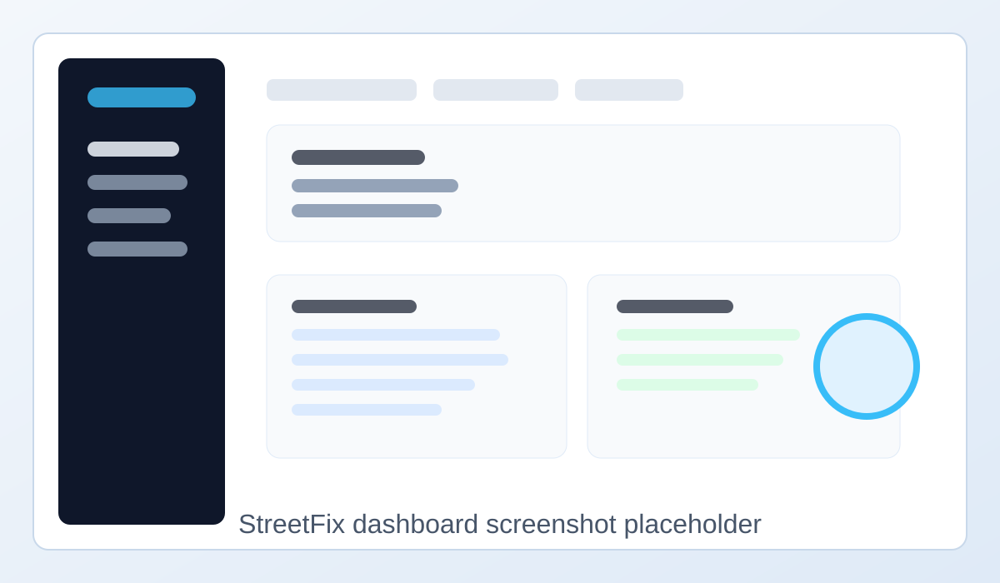
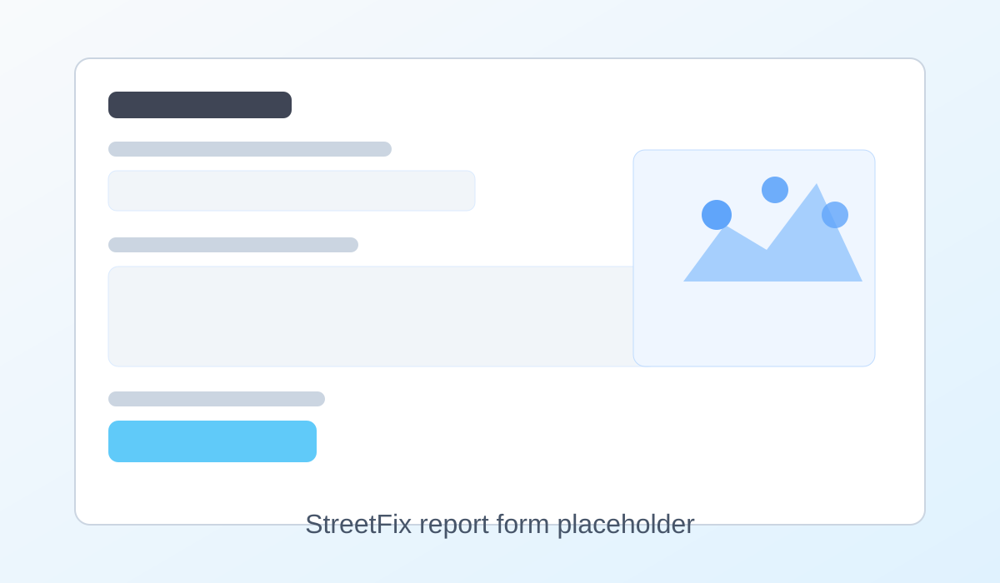
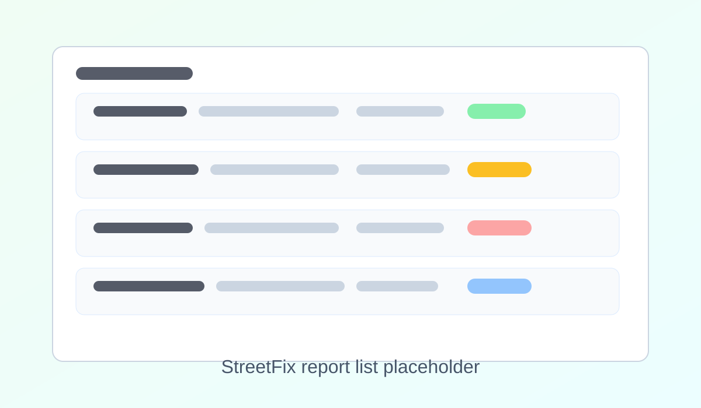

# StreetFix

StreetFix is a Rails web application built to help communities report and track local infrastructure issues such as potholes, broken sidewalks, damaged street lights, fallen trees, and downed power lines.

Residents can submit reports, add details about a problem, and vote to raise the visibility of issues that need attention. The app is designed to make it easier for communities to identify, prioritize, and monitor hazards in public spaces.

## Overview

StreetFix helps with:

- reporting location-based infrastructure problems
- describing the issue and adding context to a report
- increasing visibility through community voting
- reviewing and managing reports in an admin workflow
- creating a simple, user-friendly experience for public maintenance requests

## Runtime previews

The placeholders below are ready for real screenshots or app captures once the project is running locally.





## Tech stack

- Ruby 4.0.1
- Rails 8.1
- PostgreSQL
- Hotwire / Turbo / Stimulus
- Bootstrap styling
- Puma web server

## Prerequisites

Before installing, make sure your machine has:

- Git
- PostgreSQL
- Ruby 4.0.1 and Bundler
- Node.js and npm
- A local shell environment configured for Ruby version management

Use the single installer script for the project environment:

```bash
./installruby.sh
```

This script installs the correct Ruby version and the matching Rails version for the app, then configures Bundler.

## Installation

1. Clone the repository:

```bash
git clone <your-repository-url>
cd StreetFix
```

2. Run the single project installer:

```bash
./installruby.sh
```

This is the only install script the project uses for the runtime environment. If the script updates your shell configuration, log out and back in before continuing.

3. Start PostgreSQL and confirm it is available:

```bash
which postgres
postgres --version
```

4. Install the Ruby gems:

```bash
cd src
bundle install
```

5. Create and seed the database:

```bash
bin/rails db:setup
```

6. Start the app:

```bash
bin/rails server
```

Then open the application in your browser at:

```text
http://localhost:3000
```

## Common database commands

```bash
bin/rails db:setup
bin/rails db:reset
bin/rails db:migrate
```

## Default demo accounts

The application includes seeded users for testing:

- User: `user@example.com` / `password`
- Admin: `admin@example.com` / `password`

## Project maintenance

For project maintenance notes and operational guidance, see [docs/maintenance.md](docs/maintenance.md).

## License

This project is available under the terms in the repository license file.

## Milestones

- [x] report creation
- [x] user login and account creation
- [x] logout support
- [x] admin moderation actions
- [x] seeded testing data
- [x] homepage actions and navigation
- [x] vote counter support
- [x] sorting/filtering for reports

